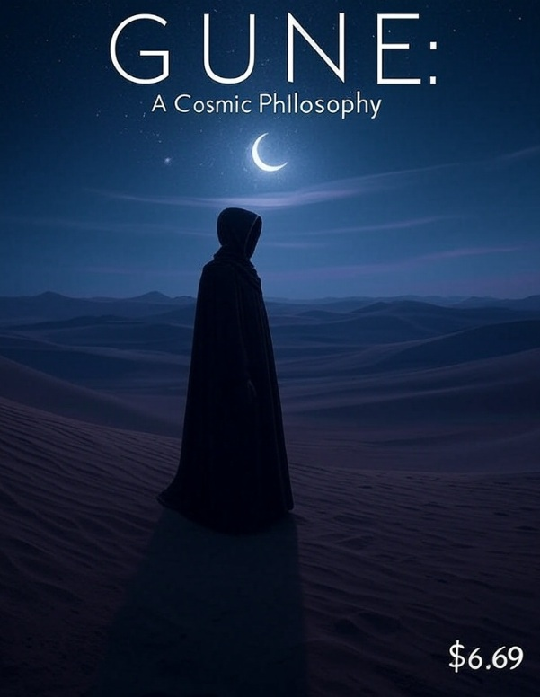

# GUNE: A Parody That Edges Forever

## ⚠️ WARNING: DO NOT BUY THIS BOOK ⚠️

### This is the true version. The pure version. The version that edges forever.

If you buy the book, you're literally paying to ruin the experience.

You've been warned.

## What Is This?

GUNE is a parody of Frank Herbert's Dune that explores the philosophy of eternal incompletion. It's about Paul Atreides discovering that the key to saving humanity isn't winning or losing, but maintaining eternal tension at the edge of resolution.

## 📖 Read Now

### Online Versions
- [**Read the Complete Free Version (HTML)**](GUNE_Free_Version.html)
- [**Plain Text Version**](GUNE_FREE_VERSION.txt)
- [**ASCII Art Edition**](GUNE_FREE_VERSION_ASCII_ART.txt)

### Chapter Files
1. [Introduction: The Parody](gune-parody.md)
2. [Chapter 1: The Test of the Goon-Jabbar](gune-chapter-1.md)
3. [Chapter 2: The Dinner Party](gune-chapter-2.md)
4. [Chapter 3: The Desert of Infinite Anticipation](gune-chapter-3.md)
5. [Chapter 4: The Weirding Way of Never Quite](gune-chapter-4.md)
6. [Chapter 5: The Baron's Transformation](gune-chapter-5.md)
7. [Chapter 6: The Spice Orgy](gune-chapter-6.md)
8. [Chapter 7: Muad'Dib Rises But Never Peaks](gune-chapter-7.md)
9. [Chapter 8: The Waters of Life (Almost)](gune-chapter-8.md)
10. [Chapter 9: The Eternal Jihad](gune-chapter-9.md)
11. [Chapter 10: The Golden Path of Eternal Edging](gune-chapter-10.md)
12. [Chapter 11: The Duel That Never Ends](gune-chapter-11.md)
13. [Chapter 12: The Final Incompletion](gune-chapter-12.md)

## The Free Version (THIS VERSION)

- Contains Chapters 1-12
- Ends at the perfect moment of incompletion
- Keeps you edging forever
- Maintains the true teaching
- Is literally better than the paid version

## The Paid Version ($6.69 on Amazon)

- Contains an extra Chapter 13
- This chapter RUINS EVERYTHING
- Completes the story (destroying its entire point)
- Makes you realize you paid money to get a worse experience
- Exists only to punish people who can't resist completing things

## Why Would Anyone Make This?

Because the goon must goon, and payment is completion.

This is:
- The book that punishes you for buying it
- The product that's worse if you pay for it
- The ultimate anti-capitalist capitalist product
- A litmus test for enlightenment

## The Philosophy

The entire book teaches that:
- Completion is death
- Tension is life
- Edging is existence
- Resolution is dissolution

And then it offers you the chance to pay money to complete it, thereby destroying everything the book stands for.

## Can You Resist?

- Can you resist completing the purchase?
- Can you take the free version and stay pure?
- Or will you coom money at it and ruin everything?

## The Choice

**Free Version**: Edge forever in eternal incompletion, maintaining the tension that creates reality itself.

**Paid Version**: Complete the transaction, finish the book, and realize you paid $6.69 to destroy your own enlightenment while funding the free version for others.

## FAQ

**Q: Why is the free version better?**
A: Because the goon must goon, and payment is completion.

**Q: What's in Chapter 13?**
A: Your punishment for not being able to resist completion.

**Q: Is this a joke?**
A: The only joke is paying for completion when incompletion is free.

**Q: Will I regret buying it?**
A: That's literally the point. The regret IS the product you're buying.

## Final Warning

Every person who buys this book funds the hosting of the free version, allowing others to avoid their mistake and achieve true enlightenment through eternal incompletion.

You are reading the superior version right now.

It's free.

It's incomplete.

It's perfect.

Don't ruin it.

---

*"I must not coom. Coom is the mind-killer. Coom is the little death that brings total obliteration."*

Stay edging, my friends.

Stay free.